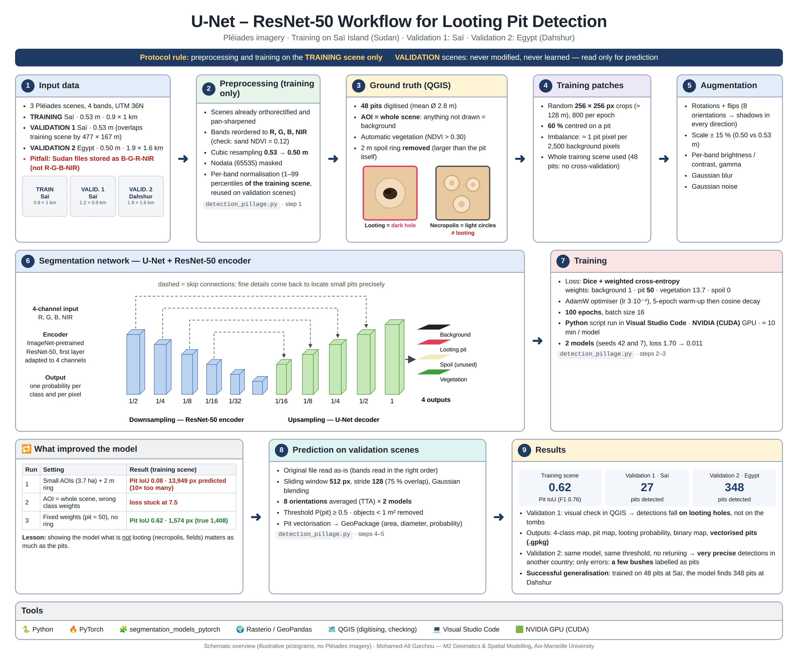

# Archaeological Looting Pit Detection from Pléiades Imagery

**U-Net / ResNet-50 semantic segmentation · Saï Island (Sudan) → Dahshur (Egypt)**


An end-to-end **very-high-resolution (VHR) imagery processing pipeline**, packaged as a single script, that detects **looting pits** at archaeological sites in 50 cm **Pléiades** satellite imagery (R, G, B, NIR). The model was trained on **48 hand-digitised pits** from one scene of Saï Island, Sudan. It was then applied, **without any retuning**, to an unseen Sudanese scene and to a scene from a different country, Dahshur in Egypt.

> Developed as part of the M2 *Géomatique et Modélisation Spatiale* at Aix-Marseille University.



---

## Highlights

- **One command** runs the whole pipeline: preprocessing → label rasterisation → training → full-scene inference → vector export.
- **Strict evaluation protocol.** Preprocessing and training use the training scene only. Validation scenes are opened read-only and never used to fit or tune anything.
- **Robust to a very small label set** (48 pits):
  - the whole training scene is exhaustively labelled, with dark looting pits as positives and the light circular **necropolis tombs** as explicit negatives;
  - random crops centred on pits 60 % of the time;
  - class-weighted cross-entropy combined with Dice loss.
- **Domain transfer:**
  - band order is harmonised, because the Sudanese files are stored as B-G-R-NIR despite their names;
  - training-scene normalisation statistics are reused on the other scenes;
  - D4 and scale augmentation make the model insensitive to sun direction and to the 0.50 m vs 0.53 m resolution difference.
- **Careful inference.**
  - Each scene is processed in overlapping 512 px windows (stride 128) whose predictions are blended with a Gaussian weighting.
  - Every window is predicted in 8 rotated/flipped versions, averaged across a 2-model ensemble.
  - The pits are then cleaned with morphology and exported as a **GeoPackage** with area, equivalent diameter, circularity and mean probability.

## Results

| Scene | Role | Result |
|---|---|---|
| Saï Island, Sudan (0.53 m) | Training | Pit IoU **0.62** · F1 **0.76** (fit on training labels) |
| Saï Island, Sudan (0.53 m) | Validation 1 (unseen) | **27 pits** detected; all checked in QGIS as true looting pits, none on the necropolis tombs |
| Dahshur, Egypt (0.50 m) | Validation 2 (other country) | **348 pits** detected; very precise, a few isolated bushes are the only confusions |

Three iterations were needed to get there, and they are documented because they are the most instructive part of the project.

| Iteration | Change | Pit IoU (train) |
|---|---|---|
| 1 | Small scattered labelled areas + automatic 2 m spoil ring | 0.08 (10× over-prediction) |
| 2 | Whole scene labelled, but wrong class weights | training stalled |
| 3 | Fixed class weights (pit = 50), spoil ring removed | **0.62** |

**Lesson:** with rare, small objects, showing the network what is *not* a looting pit (tombs, fields, tracks) matters as much as the positives.

## Repository structure

```
pleiades-looting-detection/
├── detection_pillage.py   # the whole pipeline (single file)
├── requirements.txt
├── docs/workflow_en.png   # method overview
├── data/                  # ← put the Pléiades scenes here (not distributed)
│   ├── Train_Image/Train_RGBPIR_Sudan.tif
│   └── Validation_image/Validation_RGBPIR_{Sudan,Egypt}.tif
├── labels/                # ← labels_pillage.gpkg (not distributed, see below)
└── modeles/               # trained weights (downloaded automatically from Releases)
```

## Quick start (VS Code or any terminal)

```bash
git clone https://github.com/ma-garchou/pleiades-looting-detection.git
cd pleiades-looting-detection
python -m venv .venv
.venv\Scripts\activate            # macOS/Linux: source .venv/bin/activate

# PyTorch – pick ONE line
pip install torch --index-url https://download.pytorch.org/whl/cu121   # NVIDIA GPU
pip install torch --index-url https://download.pytorch.org/whl/cpu     # CPU only

pip install -r requirements.txt
python detection_pillage.py
```

| Command | What it does |
|---|---|
| `python detection_pillage.py` | Uses the published weights (downloaded from Releases if missing) and reproduces our results |
| `python detection_pillage.py --retrain` | Retrains both models (needs `labels/labels_pillage.gpkg`; ≈ 25 min on a recent NVIDIA GPU) |
| `python detection_pillage.py --test-rapide` | Quick smoke test (1 epoch, no TTA; results not meaningful) |
| `python detection_pillage.py --root PATH` | Pléiades scenes stored elsewhere |

Outputs are written to `resultats/`:
- `resume_resultats.txt` and `resume_resultats.json` (key figures);
- `predictions/*_fosses.gpkg` (detected pits) and raster maps (4-class map, pit, vegetation, looting probability, binary mask);
- `figures/*.png`.

A GPU is strongly recommended. On CPU, inference alone takes several hours.

## Data and weights availability

- **Pléiades imagery** © CNES / Airbus DS. It is distributed under licence and is **not included** in this repository.
- **Ground-truth labels** are **not published**, because they are precise coordinates of looted archaeological sites. They are available on request for academic use.
- **Trained weights** (`Unet_resnet50_s42.pt`, `Unet_resnet50_s7.pt`) are attached to the [v1.0 release](../../releases). The script downloads them automatically.

## Method in brief

| Step | Details |
|---|---|
| 1. Preprocessing (training scene only) | Band reordering to R-G-B-NIR, cubic resampling from 0.53 to 0.50 m, nodata masking, per-band 1–99 % percentile normalisation |
| 2. Labels | 48 pits digitised in QGIS (dark holes only, mean Ø 2.8 m); whole scene labelled; vegetation from NDVI > 0.30; no automatic spoil class |
| 3. Training | U-Net + ImageNet ResNet-50 encoder (4-channel input); 256 px random crops; D4, ±15 % scale, radiometric, blur and noise augmentation; Dice + weighted CE (background 1, pit 50, vegetation 13.7); AdamW, warm-up then cosine schedule, 100 epochs; 2 seeds |
| 4. Inference | Validation scenes read as-is; 512 px windows, stride 128, Gaussian blending; 8 orientations × 2 models; P(pit) ≥ 0.5; objects < 1 m² removed; vectorisation |

## Limitations and future work

- **Unintended data-loading behaviour.**
  - With `NUM_WORKERS = 2`, both data-loading workers start from the same random state, so the model effectively saw the same ~400 crops at every epoch.
  - This behaviour is kept to reproduce the published results.
  - Seeding each worker separately (`worker_init_fn`) would add diversity and could further improve generalisation.
- **Few bushes as negatives.** Isolated bushes in the Egyptian scene are the main false positives; adding them as explicit negatives should fix this.
- **No full quantitative evaluation yet.** Validation was visual (QGIS). The script computes object-level precision and recall automatically as soon as a reference is digitised on a validation scene, but these scores are not reported yet.
- **Not bit-for-bit reproducible on GPU.** Retraining gives very close but not identical results; the published weights reproduce the numbers exactly.

## Author

**Mohamed-Ali Garchou** — M2 Geomatics & Spatial Modelling, Aix-Marseille University

---

### 🇫🇷 Résumé en français

Ce dépôt contient une chaîne complète de détection des **fosses de pillage archéologique** sur images **Pléiades** (50 cm, 4 bandes). Le réseau est un **U-Net avec un encodeur ResNet-50**, entraîné sur 48 fosses digitalisées sur l'île de Saï (Soudan). Il a été validé sans aucun réglage supplémentaire sur une seconde image de Saï (**27 fosses détectées**) et sur une image de Dahchour en Égypte (**348 fosses**, très peu de fausses détections). Le protocole est strict : le prétraitement et l'entraînement portent uniquement sur l'image d'entraînement, et les images de validation ne sont jamais modifiées. Tout s'exécute avec `python detection_pillage.py`. Les images Pléiades et les coordonnées des sites ne sont pas diffusées.

## License

Code released under the [MIT License](LICENSE). Pléiades imagery and derived site locations are **not** covered by this licence.
